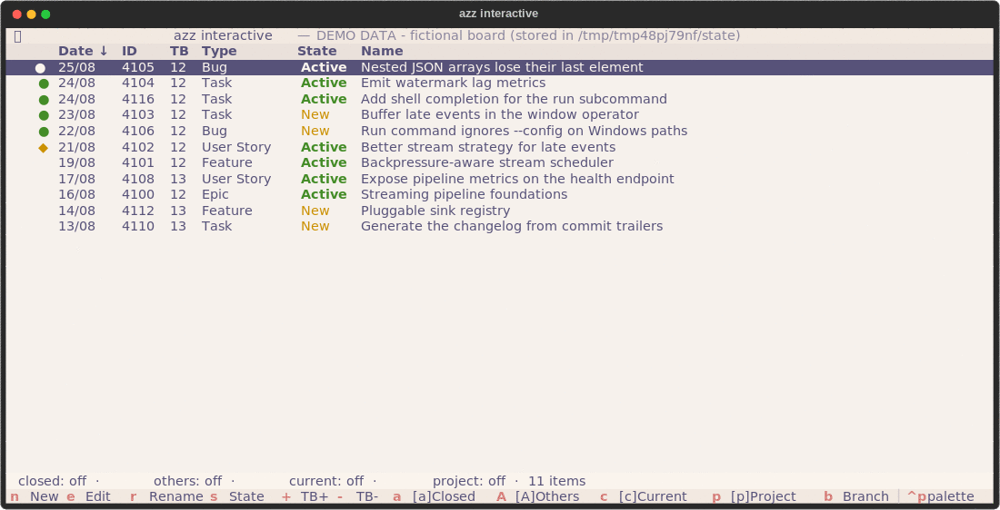

# Azz - Azure Devops CLI helper

[](https://opensource.org/licenses/Apache-2.0)
[](https://www.python.org/)
[](https://astral.sh/uv)
[](https://just.systems/man/en/)
[](https://www.docker.com/)

A simple CLI tool to help with Azure DevOps work item management,
built on top of the Azure CLI.

I only built this tool for myself,
but I thought it could be useful for others as well,
so I decided to make it public.
Feel free to clone it to adapt it to your needs.



The recording above is `azz --demo interactive` — a bundled fictional board,
no Azure DevOps account needed. See [Demo mode](#demo-mode).

## Installation

Requirements:

- [azure cli](https://learn.microsoft.com/en-us/cli/azure/get-started-with-azure-cli?view=azure-cli-latest)
- [uv](https://docs.astral.sh/uv/getting-started/installation/)
- An Azure DevOps organization and project
  - the tool is based on the Epic-Feature-Task work item hierarchy

Recommended:

- unix-like environment
  The tool was only tested on Linux
- [direnv](https://github.com/direnv/direnv)
  For loading environment variables from .envrc files.
  It permits you to have different configurations for different projects.

Installation:

```bash
# From pypi
uvx add azz # Not published yet, but will be available soon

# From source 
git clone
cd Azz

uv tool install . # classic install
just install # classic install using justfile
uv tool install --editable . # dev install
just install-dev # dev install using justfile
```

Then to verify the installation

```bash
azz --version
```

## Usage

In your project repository,
configure a `.envrc` file like `.envrc.example`.

### Plan engine

Declarative work item management: express the desired state in local files,
diff it against Azure DevOps, apply it with confirmation.

```bash
azz plan init                # create the gitignored .azz/ directory
azz plan fetch               # record your 20 most recent items in .azz/cache
azz plan fetch 7651 7695     # or just these ones
azz plan fetch -a -l 0       # everything, Closed included — a full local archive
```

One Markdown file per work item under `.azz/tasks/`:

```markdown
---
item_id: 1234
title: Implement login page
state: Active
type: Task
parent: 100
iteration: Sprint 42
---

The body of the file is the work item description.
```

Omit `item_id` to mark the file as a new task — it is written back into the
file once the item is created. Fields absent from the frontmatter are never
compared and never written, so a file containing only `title` will only ever
touch the title. Nothing in the file is tool-managed except `item_id` and
the title, both written back after a create — the remote state azz compares
against lives in `.azz/cache/`, not in your files.

Only the items you are working on are kept locally. Fetch as many as you
want, delete the files you no longer need — a missing file never means
"delete the work item".

```bash
azz plan status           # offline: .azz/tasks vs .azz/cache
azz plan pull             # write the cache into .azz/tasks, fast-forward only
azz plan push             # apply, confirming each change
azz plan push --dry-run   # show what would be applied
azz plan push --yes       # apply without per-change confirmation
```

`fetch` and `pull` are separate, the way git separates them. `fetch` records
what the remote said in `.azz/cache/` and never touches your files; `pull`
writes that into `.azz/tasks/`, fast-forwarding only the files you have not
edited and refusing the ones where both sides moved. That cached copy is the
merge base, which is what lets `status` run fully offline and tell a remote
edit apart from one of yours instead of guessing.

Fetch options: `-l/--limit N` (default 20, `0` for no limit), `-a/--all` to
include Closed items, `-c/--current-timebox`. `-a -l 0` pulls the same set as
`azz list -a` — every work item assigned to you in the configured projects,
whatever its state.

Once the archive is on disk, prune it back to the work in flight:

```bash
azz plan prune --dry-run   # list what would go
azz plan prune             # delete, after one confirmation
azz plan prune --yes       # delete without confirming
```

`prune` removes a file only when the work item is Closed on the remote *and*
the file is in sync with it. Local drift, files with no `item_id`, and files
whose item is gone from the remote are always kept.

`.azz/` is gitignored by default. A missing file never means "delete" —
`prune` only ever touches local files, and deletion on Azure DevOps stays
explicit via `azz delete`.

See [the design decision](docs/decisions/2026-07-24-plan-engine.md) for the
rationale.

### Setting up Claude in your project

Run this from the repository you want Claude to work on — not from the azz
checkout:

```bash
cd ~/my-project
azz plan init                     # create the gitignored .azz/ directory
azz claude install                   # personal: nothing added to the repo
azz claude install --scope project   # shared: for a team that all uses azz
azz claude install standard          # also allow the imperative write commands
azz claude list                      # what each profile and scope grants
```

**The default install adds nothing to the repository**, so it is safe to run
in a work repo your colleagues share. It writes:

- `.claude/skills/azz/SKILL.md` — the workflow and the file format, loaded
  only when the conversation is actually about tasks
- `.claude/settings.local.json` — the permissions the harness enforces

The skill directory gets a `.gitignore` containing `*`, so it ignores itself
the way tool caches do — the same pattern `azz plan init` writes into `.azz/`.
`settings.local.json` is covered by `.git/info/exclude` when git does not
already ignore it. Nothing the repository tracks is touched, and your
`git status` stays clean.

`--scope project` is for a repository where the whole team uses azz: the
permissions go to the shared `settings.json`, a short note is added to
`AGENTS.md` for agents that do not read skills, and nothing is excluded — you
commit the files.

Use `--target <dir>` to install somewhere other than the current directory.

**It is idempotent — re-run it whenever you like.** The skill file is owned by
azz and rewritten wholesale, and the exclude lines are not duplicated. The
`AGENTS.md` note sits between
`<!-- azz:begin -->` markers, so the rest of the file is untouched. In
`settings.json`, only rules starting with `Bash(azz` are replaced; your other
permissions, `env`, and hooks are preserved. Because the old `azz` rules are
dropped before the new ones are written, switching profiles leaves nothing
stale behind — that is the upgrade path too.

Older versions appended their docs to `CLAUDE.md`. Re-installing removes that
block: the skill replaces it, and is not loaded on every conversation.

| Profile | Claude can | Claude cannot |
|---|---|---|
| `planning` | read the remote, author intent files in `.azz/tasks/` | change Azure DevOps at all — every write command is denied |
| `standard` | the above, plus `create`, `state`, `close`, `attach`, `set_timebox` behind a prompt | `edit`, `delete`, `plan push` |

`planning` is the default and is less restrictive than it sounds: Claude can
plan a whole batch of work as Markdown, you review it like a git diff and
apply it yourself. `azz plan push` is never allow-listed in either profile —
it confirms each change on a TTY, so an agent cannot usefully run it, and the
only way to change that would be `--yes`, which removes the review step the
plan engine exists to provide.

See [docs/claude.md](docs/claude.md) for details.

### Demo mode

Want to try azz before configuring anything? Demo mode runs against a bundled
fictional board, with no Azure DevOps account and no environment variables:

```bash
azz --demo interactive
```

See [docs/demo.md](docs/demo.md) for the details and for regenerating the
recording above.
